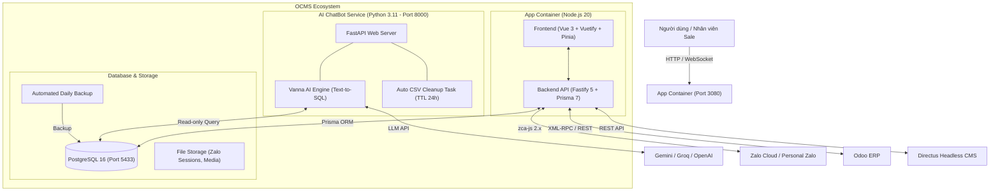

# OCMS — Omnichannel Customer Management System & AI Zalo CRM

> Hệ thống quản lý tập trung đa tài khoản Zalo cá nhân, tích hợp Trợ lý AI phân tích dữ liệu thông minh, kết nối đồng bộ 2 chiều với **ERP Odoo** và **Directus Headless CMS**.

---

## 📌 Tổng quan dự án

**OCMS** là giải pháp toàn diện cho doanh nghiệp và đội ngũ kinh doanh bán hàng qua Zalo:

- **Tập trung hóa hộp thư**: Quản lý nhiều tài khoản Zalo cá nhân trên một giao diện web duy nhất, phân quyền tài khoản cho từng nhân viên/đội nhóm.
- **Trợ lý AI ChatBot**: Được tích hợp mô hình Text-to-SQL (Vanna AI + LLM) giúp nhân viên và quản lý tra cứu doanh thu, lịch sử mua hàng của khách, tự động lên form đơn hàng `[ORDER_DRAFT]` và vẽ biểu đồ trực quan.
- **Đồng bộ ERP Odoo & Directus**: Liên kết dữ liệu khách hàng, đơn hàng, trạng thái giao vận, bảng giá sỉ/lẻ và chương trình khuyến mãi combo.

---

## 🏗️ Sơ đồ kiến trúc hệ thống



---

## ✨ Tính năng nổi bật

### 1. Quản lý Đa tài khoản Zalo Cá nhân

- Đăng nhập quét mã QR trực tiếp trên web, tự động khôi phục phiên kết nối (`reconnect`).
- Cơ chế chống khóa tài khoản Zalo (Rate Limiting: giới hạn 200 tin/ngày, giãn cách thời gian gửi tin ngẫu nhiên).
- Phân quyền chi tiết: **Xem**, **Chat**, hoặc **Quản lý** tài khoản cho từng nhân viên.

### 2. Khung Chat CSKH Real-time & Quản lý Pipeline

- Nhắn tin thời gian thực qua Socket.IO (hỗ trợ văn bản, biểu tượng cảm xúc, ảnh, tài liệu file, nhắc hẹn).
- Quản lý thông tin khách hàng: SĐT, địa chỉ, gắn nhãn phân loại (Tags), ghi chú nội bộ.
- Phân loại khách hàng theo đường ống bán hàng (Pipeline): *Mới → Đã liên hệ → Quan tâm → Chuyển đổi → Mất*.

### 3. Trợ lý AI ChatBot Phân tích & Hỗ trợ Bán hàng

- **Text-to-SQL**: Dịch câu hỏi tiếng Việt tự nhiên thành truy vấn SQL truy xuất dữ liệu CRM/Odoo tức thì.
- **Tự động đề xuất đơn hàng `[ORDER_DRAFT]`**: Nhận diện tên khách, số điện thoại, danh sách sản phẩm và số lượng từ hội thoại chat để tạo thẻ đơn hàng tương tác (thay đổi số lượng, tổng tiền realtime).
- **Vẽ biểu đồ tự động**: Tạo đồ thị doanh thu, sản lượng qua Plotly khi có yêu cầu.
- **Tự động dọn dẹp dữ liệu tạm**: File CSV truy vấn tự động xóa sau 3 ngày (TTL 72h) để tối ưu dung lượng hệ thống.

### 4. Tích hợp Odoo ERP & Quản trị Bán hàng

- Đồng bộ dữ liệu Khách hàng (`customer_profiles`), Đơn hàng (`order_histories`), Chi tiết sản phẩm (`order_line_histories`).
- Theo dõi trạng thái đơn hàng (Bản nháp, Đã xác nhận, Đã hủy, Hoàn tất), trạng thái giao vận và margin lợi nhuận.
- Tạo đơn hàng Odoo trực tiếp từ khung chat Zalo.
- Bảng doanh số chi tiết theo từng chuyên viên bán hàng (Staff Sales Table).

### 5. Tích hợp Directus Headless CMS & Khuyến mãi Combo

- Quản lý danh mục sản phẩm chuẩn, quy cách đóng gói, giá niêm yết và giá sỉ/đại lý.
- Công cụ tính toán ưu đãi khuyến mãi combo (La Pet) tự động.
- Xuất danh sách sản phẩm Odoo/Directus ra file Excel định dạng chuẩn.

---

## 🛠️ Công nghệ sử dụng

| Phân hệ                             | Công nghệ chính                                                          |
| ------------------------------------- | --------------------------------------------------------------------------- |
| **Frontend**                    | Vue 3, Vite, Vuetify 3, Pinia, Vue Router, Chart.js / Plotly                |
| **Backend**                     | Node.js 20, Fastify 5, TypeScript, Prisma 7, Socket.IO, ExcelJS             |
| **Zalo Gateway**                | zca-js 2.x                                                                  |
| **AI ChatBot**                  | Python 3.11, FastAPI, Vanna AI, Google Gemini Flash / Groq / OpenAI         |
| **Cơ sở dữ liệu**           | PostgreSQL 16 Alpine                                                        |
| **Sao lưu tự động**         | `prodrigestivill/postgres-backup-local` (Lưu 7 ngày, 4 tuần, 3 tháng) |
| **Môi trường & Triển khai** | Docker & Docker Compose (Multi-stage Build)                                 |

---

## 🚀 Cài đặt & Khởi chạy nhanh

> Xem hướng dẫn cài đặt chi tiết từng bước: [HUONG-DAN-CAI-DAT.md](HUONG-DAN-CAI-DAT.md)

### 1. Yêu cầu môi trường

- Máy chủ Linux (Ubuntu 20.04/22.04 LTS) hoặc máy tính cá nhân đã cài **Docker & Docker Compose**.
- Khuyến nghị: 2-4 vCPU, 4GB RAM, 20GB SSD.

### 2. Các bước khởi chạy

```bash
# 1. Clone repository
git clone https://github.com/Salt05/OCMS.git
cd OCMS

# 2. Tạo file cấu hình môi trường
cp .env.example .env

# 3. Điền các thông tin mật khẩu DB, Secret Keys và API Keys vào .env
nano .env

# 4. Khởi chạy toàn bộ hệ thống bằng Docker Compose
docker compose up -d --build
```

Sau khi khởi chạy:

- **Ứng dụng chính (Web CRM)**: `http://localhost:3080` (hoặc domain của bạn).
- **Trợ lý AI ChatBot Web độc lập**: `http://localhost:8000`.
- **Cơ sở dữ liệu PostgreSQL**: `localhost:5433`.

Tài khoản Admin đầu tiên sẽ được tạo trong lần truy cập đầu tiên tại trang `/setup`.

---

## 💻 Các lệnh CLI hỗ trợ phát triển (Development)

Trong thư mục `backend/`:

```bash
# Khởi chạy môi trường dev backend
npm run dev

# Mở giao diện quản trị cơ sở dữ liệu Prisma Studio
npm run db:studio

# Thử nghiệm tương tác ChatBot AI trực tiếp từ terminal
npm run chat:cli

# Xuất danh mục sản phẩm Odoo kèm mapping Directus ra file Excel
npm run export:products
```

---

## 📚 Tài liệu chi tiết

- 📖 **[Hướng dẫn cài đặt chi tiết (Setup Guide)](HUONG-DAN-CAI-DAT.md)**: Cài đặt Docker, cấu hình SSL HTTPS, cấu hình Odoo, Directus và LLM.
- 📘 **[Hướng dẫn sử dụng toàn diện (User Manual)](HUONG-DAN-SU-DUNG.md)**: Hướng dẫn dành cho nhân viên kinh doanh và quản lý.

---

## 📄 Bản quyền (License)

Dự án được phân phối dưới giấy phép **MIT License**.
