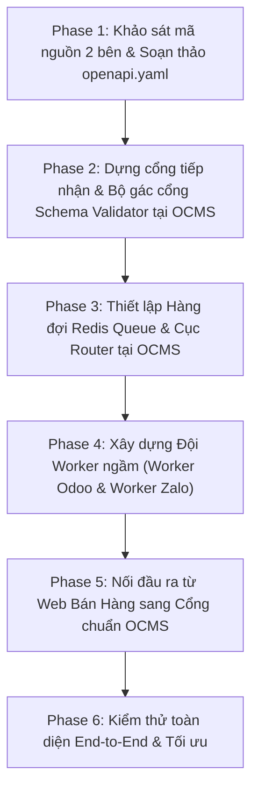

# Kế Hoạch Triển Khai: Chuẩn Hóa API & Kiến Trúc Hàng Đợi (Event Router & Workers)

Kế hoạch này vạch ra lộ trình từng bước để kết nối **Web Bán Hàng** và hệ thống **OCMS** thông qua **Hợp đồng dữ liệu chuẩn (`openapi.yaml`)** và **Trục hàng đợi bất đồng bộ (Redis Queue + Workers)**.

> [!NOTE]
> **Bối cảnh hệ thống:** Công ty hiện có 2 phần mềm chính:
>
> 1. **Web Bán Hàng (store-lapet):** Nơi khách hàng chọn mua và đặt hàng.
> 2. **OCMS:** Trung tâm vận hành nội bộ (quản lý đơn hàng, kết nối Odoo ERP, gửi tin Zalo, AI Chatbot).
>
> *Người dùng sẽ gắn thư mục mã nguồn Web Bán Hàng vào workspace để Agent có thể trực tiếp đối chiếu cả 2 bên.*

---

## User Review Required

> [!IMPORTANT]
> **Điểm cần thống nhất trước khi chạy:**
>
> 1. **Vị trí thư mục Web Bán Hàng:** Khi người dùng đưa mã nguồn Web vào, vui lòng đặt tên thư mục rõ ràng (ví dụ: `web-shop/` hoặc `frontend-store/`) ở thư mục gốc của workspace.
> 2. **Công nghệ hàng đợi:** Chúng ta sẽ tận dụng **Redis** (đã có sẵn trong `docker-compose.dev.yml` của OCMS) kết hợp với thư viện **BullMQ** (chuẩn công nghiệp cho Node.js/TypeScript).
> 3. **Tính tương thích ngược:** Luồng tạo đơn cũ từ AI Chatbot Zalo trong OCMS sẽ được giữ nguyên hoạt động song song trong giai đoạn chuyển tiếp, đảm bảo không làm gián đoạn vận hành hiện tại.

---

## Lộ Trình Triển Khai (Phân Theo Từng Phase Cho Agent)

---

### Phase 1: Khảo sát mã nguồn 2 bên & Soạn thảo `openapi.yaml`

* **Mục tiêu:** Định nghĩa ngôn ngữ chung duy nhất cho thực thể Đơn Hàng (Canonical Order Model).
* **Nhiệm vụ của Agent:**
  1. Đọc và phân tích cấu trúc đơn hàng hiện tại của **Web Bán Hàng** (giỏ hàng, thông tin khách, địa chỉ, tổng tiền).
  2. Đọc và phân tích module tạo đơn trong **OCMS** (`order-routes.ts`, `schema.prisma`, `odoo-service.ts`).
  3. Lập bảng đối chiếu (Data Mapping Table) giữa các trường của Web và OCMS/Odoo.
  4. Tạo file chuẩn **`docs/openapi.yaml`** quy định API: `POST /api/v1/orders/standard`:
     * Bắt buộc: `order_code`, `customer_name`, `customer_phone`, `shipping_address`, `items` (gồm `sku`, `quantity`, `price`), `total_amount`.
     * Tùy chọn: `note`, `payment_method`, `voucher_code`.
     * Mã phản hồi: `201 Created` (Thành công), `400 Bad Request` (Sai cấu trúc).
* **Sản phẩm đầu ra:** File `docs/openapi.yaml` hoàn chỉnh được người dùng duyệt.

---

### Phase 2: Dựng cổng tiếp nhận & Bộ kiểm duyệt tự động (Schema Validator) tại OCMS

* **Mục tiêu:** Xây dựng "cửa khẩu" chặn dữ liệu rác, đảm bảo mọi đơn hàng đổ vào OCMS đều đúng 100% chuẩn YAML.
* **Nhiệm vụ của Agent:**
  1. Cài đặt thư viện kiểm duyệt dữ liệu (như `zod` hoặc `ajv` phù hợp với hệ sinh thái Fastify/TypeScript của OCMS).
  2. Tạo route tiếp nhận mới trong OCMS: `POST /api/v1/orders/standard`.
  3. Gắn bộ kiểm duyệt (Validator Middleware) vào route này:
     * Kiểm tra từng trường dữ liệu theo đúng file `openapi.yaml`.
     * Nếu thiếu số điện thoại, sai định dạng tiền tệ hoặc SKU rỗng ➔ Lập tức trả về mã `400` kèm thông báo lỗi chi tiết.
* **Sản phẩm đầu ra:** Cổng API tiếp nhận đơn chuẩn có khả năng tự động từ chối dữ liệu sai lệch.

---

### Phase 3: Thiết lập Trục Hàng Đợi (Queue) & Cục Router điều phối trong OCMS

* **Mục tiêu:** Biến cổng tiếp nhận thành cơ chế bất đồng bộ siêu tốc: nhận đơn ➔ cất vào hàng đợi ➔ trả lời Web ngay trong 0.05 giây.
* **Nhiệm vụ của Agent:**
  1. Cài đặt thư viện hàng đợi **BullMQ** và kết nối tới Redis có sẵn của OCMS.
  2. Khởi tạo 2 hàng đợi (Queues) chuyên biệt:
     * `queue_odoo`: Chuyên việc đồng bộ hóa sang ERP Odoo.
     * `queue_zalo`: Chuyên việc gửi tin nhắn thông báo cho khách hàng.
  3. Xây dựng logic **Event Router** (`order-event-router.ts`):
     * Khi nhận được đơn hàng hợp lệ từ Phase 2 ➔ Lưu thông tin đơn vào bảng `OrderHistory` của Postgres (ở trạng thái `pending`).
     * Đồng thời, Router nhân bản và ném gói việc vào cả `queue_odoo` và `queue_zalo`.
     * Trả về ngay lập tức cho bên gửi mã phản hồi `201` với thông báo: *"Đơn hàng đã được tiếp nhận thành công"*.
* **Sản phẩm đầu ra:** Cơ chế hàng đợi Redis chạy ổn định, tiếp nhận đơn và phân luồng độc lập.

---

### Phase 4: Xây dựng Đội Worker ngầm (Worker Odoo & Worker Zalo)

* **Mục tiêu:** Xử lý các tác vụ nặng ở hậu trường mà không làm ảnh hưởng đến luồng chính.
* **Nhiệm vụ của Agent:**
  1. **Xây dựng `odoo-worker.ts`:**
     * Lắng nghe ngăn kéo `queue_odoo`.
     * Bốc đơn hàng ra ➔ Gọi `odooService.createSaleOrder()` để tạo Sale Order trên Odoo.
     * Cập nhật mã `odooOrderId` vào bảng đơn hàng trong OCMS khi hoàn tất.
  2. **Xây dựng `zalo-worker.ts`:**
     * Lắng nghe ngăn kéo `queue_zalo`.
     * Bốc đơn hàng ra ➔ Gọi API Zalo (Zalo OA hoặc bot) để gửi tin nhắn xác nhận kèm mã đơn cho khách.
  3. **Cấu hình chính sách phục hồi lỗi (Retry Policy):**
     * Nếu Odoo hoặc Zalo bị lỗi mạng: Tự động thử lại 3 lần (sau 1 phút, 3 phút, 5 phút).
     * Báo lỗi vào log nếu sau 3 lần vẫn thất bại, không làm mất đơn.
  4. Tích hợp việc khởi động các Worker này vào file `app.ts` của backend OCMS.
* **Sản phẩm đầu ra:** Các worker chạy ngầm độc lập, tự động tiêu thụ đơn từ Redis và xử lý sang Odoo/Zalo.

---

### Phase 5: Nối đầu ra từ Web Bán Hàng sang Cổng chuẩn OCMS

* **Mục tiêu:** Chuyển đổi Web Bán Hàng sang sử dụng chuẩn giao tiếp mới.
* **Nhiệm vụ của Agent:**
  1. Tìm đến hàm xử lý hành động khi khách bấm "Đặt hàng" trên mã nguồn Web Bán Hàng.
  2. Sửa đoạn đóng gói dữ liệu: Gom giỏ hàng và thông tin người mua đúng theo định dạng của file `openapi.yaml`.
  3. Đổi địa chỉ gọi API sang endpoint mới của OCMS: `POST /api/v1/orders/standard`.
  4. Xử lý phản hồi: Khi OCMS trả về `201`, Web lập tức chuyển khách sang trang "Đặt hàng thành công".
* **Sản phẩm đầu ra:** Web Bán Hàng gửi đơn trơn tru sang OCMS theo chuẩn mới.

---

### Phase 6: Kiểm thử toàn diện (End-to-End Verification)

* **Mục tiêu:** Đảm bảo toàn bộ hệ thống hoạt động chính xác từ lúc khách bấm mua đến lúc Odoo có đơn và khách nhận tin Zalo.
* **Các kịch bản kiểm thử:**
  1. **Kịch bản Luồng Chuẩn:** Đặt 1 đơn trên Web ➔ Kiểm tra Web phản hồi dưới 0.1s ➔ Kiểm tra Redis có job ➔ Kiểm tra Odoo xuất hiện đơn hàng ➔ Kiểm tra Zalo gửi tin nhắn.
  2. **Kịch bản Dữ liệu Sai:** Gửi đơn thiếu SĐT từ Web ➔ Kiểm tra OCMS trả về lỗi `400` rõ ràng, không lọt vào hàng đợi.
  3. **Kịch bản Odoo Giả lập Lỗi:** Tạm thời ngắt kết nối Odoo ➔ Đặt đơn từ Web ➔ Khách vẫn mua được bình thường ➔ Worker tự động xếp hàng chờ và thử lại khi Odoo bật lại.

---

## Verification Plan

### Automated / Script Testing

* Viết script giả lập `test-standard-order-flow.ts` để bắn thử đơn hàng mẫu vào `POST /api/v1/orders/standard` và kiểm tra phản hồi.
* Kiểm tra trạng thái Redis Queue bằng lệnh kiểm tra số lượng job chờ / job hoàn thành.

### Manual Verification

* Mở giao diện Web Bán Hàng, thao tác đặt 1 đơn hàng thật.
* Mở giao diện OCMS (màn hình Quản lý Đơn hàng) kiểm tra đơn đã xuất hiện.
* Mở Odoo kiểm tra Sale Order đã được tạo đúng mã SKU và giá tiền.
